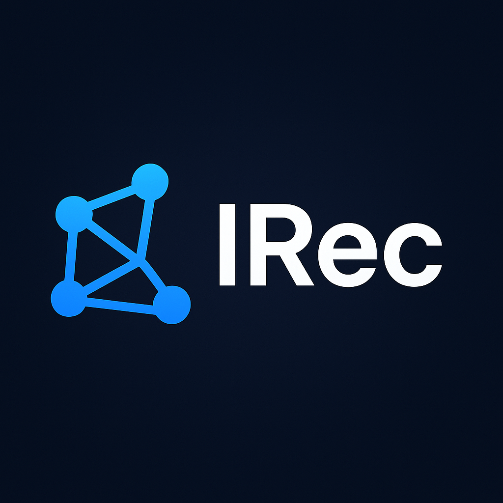

<p align="center">
   <a>
      
   </a>
</p>

<p align="center">
   <a>
      
   </a>
   <a href="https://github.com/astral-sh/ruff">
      
   </a>
   <a>
      
   </a>
</p>

**IRec** is a config-driven PyTorch framework for reproducible research in sequential and graph-based recommendation.

## Installation

### Using uv (Recommended)

1. Create and activate a virtual environment:
   ```bash
   uv venv --python 3.12
   source ./.venv/bin/activate
   ```

2. Install dependencies:

   **For development**
   ```bash
   uv sync --all-extras --frozen
   ```

   **For production**
   ```bash
   uv sync --frozen
   ```

### Using pip

1. Create and activate a virtual environment:
   ```bash
   python3 -m venv .venv
   source ./.venv/bin/activate
   ```

2. Install dependencies:

   **For development:**
   ```bash
   pip install -e ".[dev]"
   ```

   **For production:**
   ```bash
   pip install -e .
   ```

## Preparing datasets
All datasets used in our experiments are available for download from our cloud storage.

- [Google drive](https://drive.google.com/drive/folders/1dt6eojPi5UILKG5KMVQi-jP5QG1t-HJx?usp=sharing)

After downloading, place the raw files in a folder of your choice. Example structure we recommend:
```
./data/
└── Clothing/
    └── data.csv
```

To prepare the raw data for training, run the Jupyter notebooks provided in the [notebooks](./notebooks) directory. The notebooks will generate the required `.txt` data splits.

**Important:** Before running a notebook, make sure that the file paths inside it point to your downloaded raw data and the desired output location.

## Model training
To train a model, simply run the following from the root directory:
```shell
train --params /path/to/config
```

Alternatively, if you prefer to use your own virtual environment (and already have all dependencies installed) but don't want to install the `irec` package into it, ensure your venv is activated and run this from the project's root directory:

```shell
PYTHONPATH=$PWD/src python -m irec.train --params /path/to/config
```

The script has 1 input argument: `params` which is the path to the json file with model configuration. The example of such file can be found [here](./configs). This directory contrains json files with model hyperparameters and data preparation instructions. It should contain the following keys:

-`experiment_name` Name of the experiment

-`dataset` Information about the dataset

-`dataloader` Settings for dataloader

-`model` Model hyperparameters

-`optimizer` Optimizer hyperparameters

-`loss` Naming of different loss components

-`callbacks` Different additional traning 

-`use_wandb` Enable Weights & Biases logging for experiment tracking