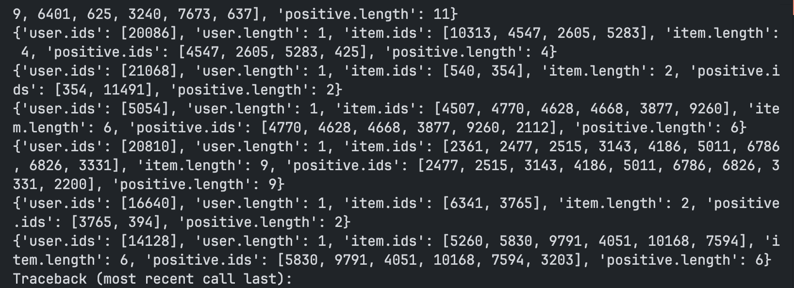

# Review

## Todos

- check TODOPK
- у нас авторегрессионный next item prediciton? то есть:

1) items (10)
2) semantic_ids (40)
3) prediciting 11th item (next 4 semantic ids)
4) if single - ok
5) if several?
6) if nothing?

- posterior collapse (как будто все сваливается в один индекс в кодбуке) (fixed eval code)
- обязательно использование reinit unused clusters! (mark)
- в Amazon датасете пофиг на rating? получается учитываются только implicit действия?
- TODO какой базовый класс использовать для e2e модели? (LastPred?)
- TODO имя для модели (tiger)

Почему одинаковые длины?

## Links

- [dataset](https://cseweb.ucsd.edu/~jmcauley/datasets/amazon/links.html)

## Remarks

- no biases on leave one out strategy (обрезаем по строго временному порогу)

## Todo

### Train full encoder-decoder

- На чем обучать? То есть на каких данных запускать backward pass?
- train model

### Collisions

- fix collisisons
- last index = `KMeans(last residuals, n=|last codebook|)` - collision
- remainder = last embedding
- auto increment last index (check paper)
- Research last index aggregation
  
#### possible collisions example

- item1: 1 2 3 0
- item2: 1 2 3 1
- item3: 4 5 6 0/2
- item4: 4 5 6 1/3

### Retreive

- single item -> ok
- too many items -> get embeddings -> score. Softmax(collisions), torch.logsoftmax(logits) -> score -> argmax

### Framework

- positional emb for item & codebook
- splitting item ?

### positional embeddings example

- (000 111 222) - item
- (012 012 012) - codebook

### Fixes in framework

- user_id & codebook_ids -> repr ???
- add last 'sequence' prediction, now only last item is supported
- dataloader (semantic ids lens)
